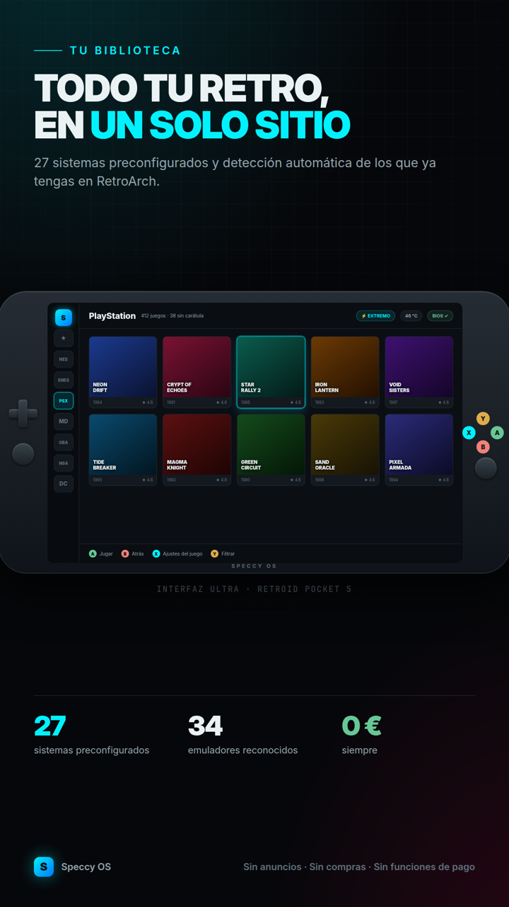
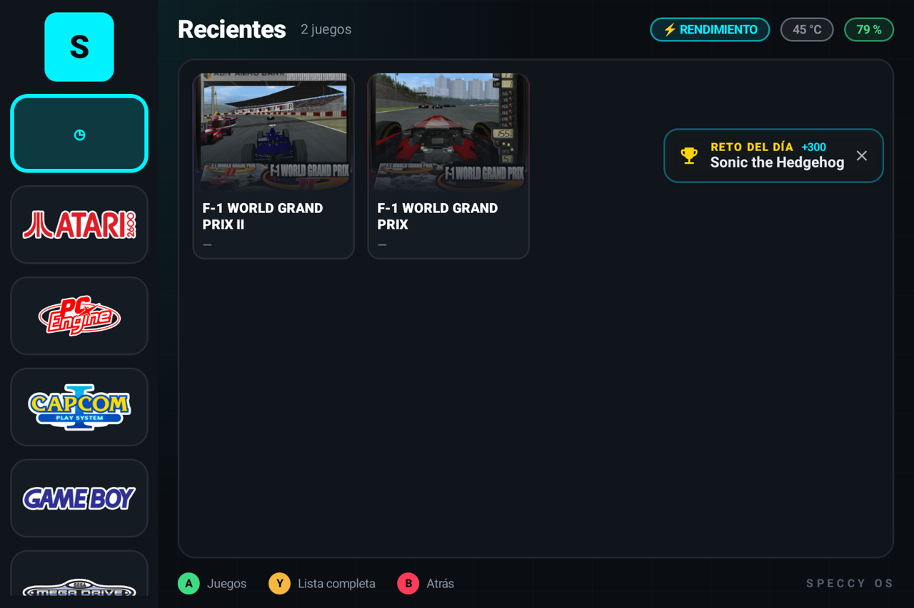
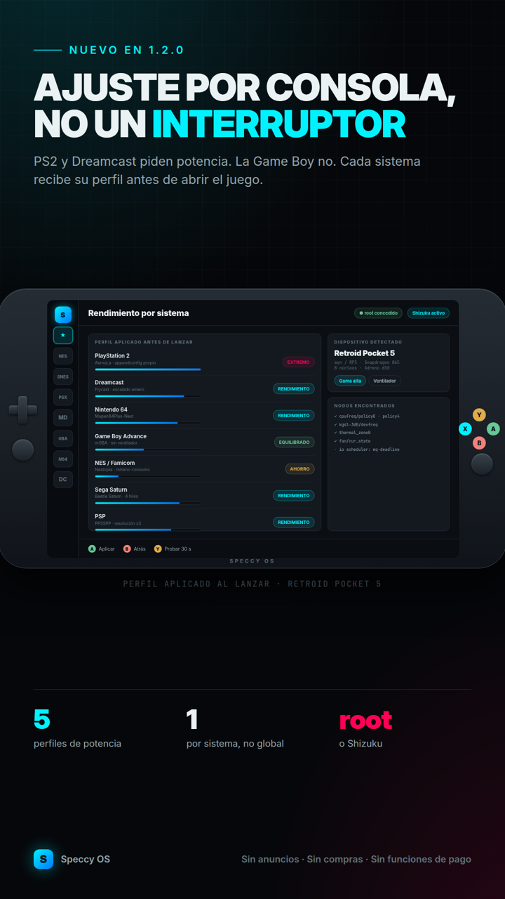
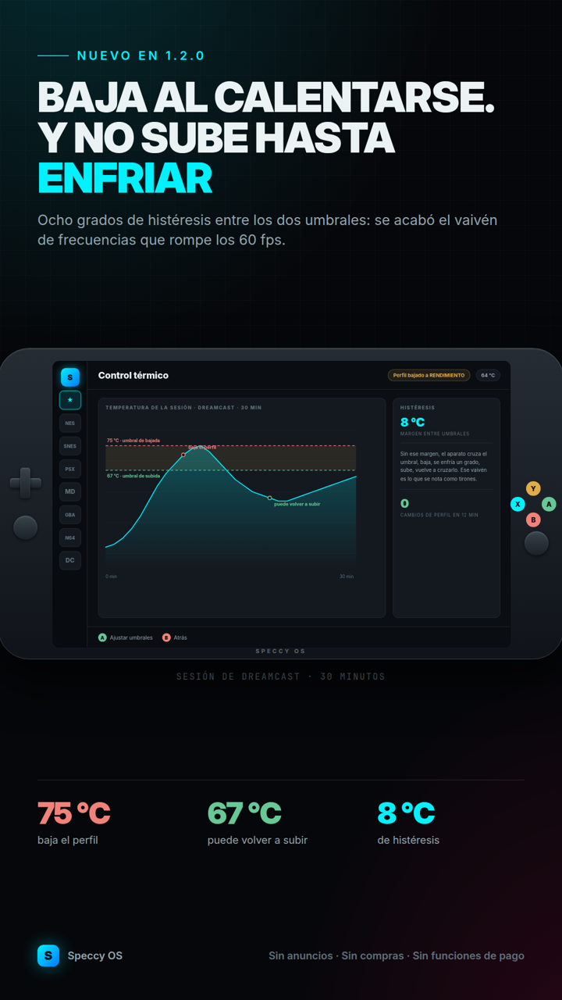
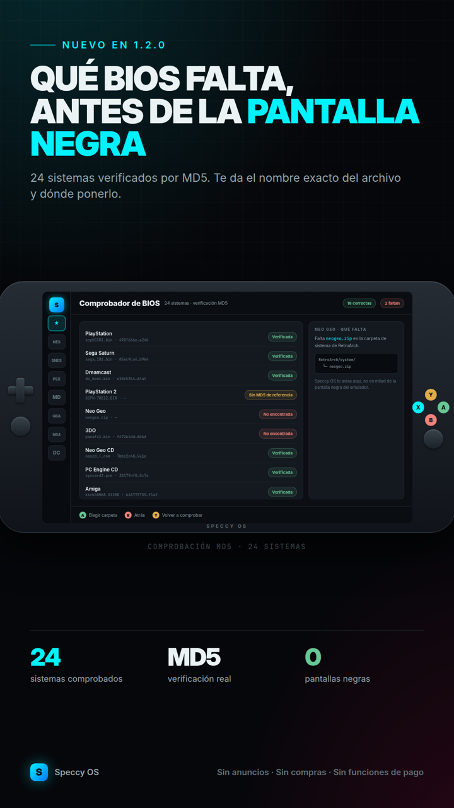
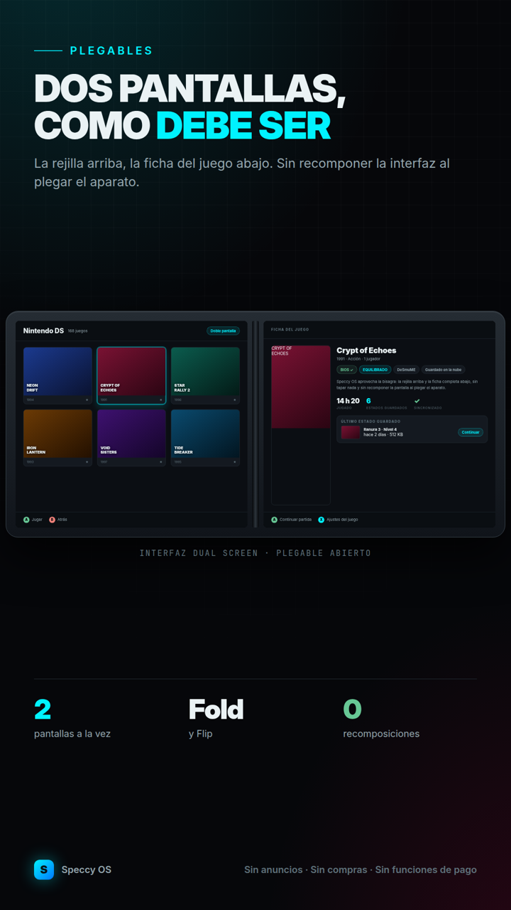
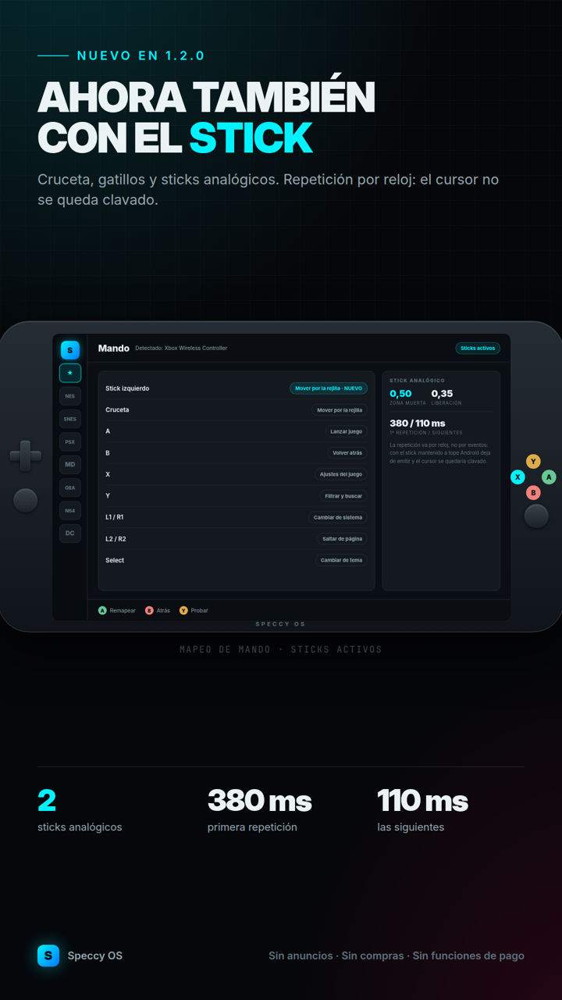

# Speccy OS

**[English](README.md) · [Español](README.es.md)**

**Frontend retro para Android.** Ordena tu colección, la pone bonita y lanza cada
juego con el emulador que le conviene, ajustando la consola antes de arrancar.

Gratis, sin anuncios y sin suscripciones. **No incluye juegos ni BIOS**: es el
escaparate y el director de orquesta de lo que ya tienes.

[](https://play.google.com/store/apps/details?id=com.generacionarcade.speccyos)


---

## De dónde viene

Speccy OS nació con un objetivo muy concreto: **sacarle todo el partido a una
GameMT E5 Ultra**. Una consola china honesta, con buen mando y una pantalla
decente, pero con un lanzador de serie pobre y un procesador que hay que saber
tratar para que mueva una PS2.

Resolver eso bien —detectar el hardware real, subir las frecuencias solo cuando
hace falta, encontrar las BIOS donde el emulador las busca, elegir el core que de
verdad arranca— resultó ser lo mismo que hace falta en **cualquier** consola
Android. Así que hoy Speccy OS funciona igual de bien en una Retroid Pocket 6, en
una AYN Odin 3, en un móvil con un mando o en una tele con un Fire TV Stick; y,
por supuesto, **en toda la gama nueva de GameMT** (EX8, EX5, E6, E5 Ultra…).

La E5 Ultra sigue siendo la consola de referencia donde se prueba cada versión,
pero ya no es la única que importa.

---

## Qué hace

**Biblioteca**
- Escanea tus carpetas de ROMs y las organiza por sistema, con carátulas, vídeos
  y fichas descargadas con el scraper integrado (ScreenScraper).
- Cinco temas distintos: Ultra HD, Speccy OS, Pure, **Studio** (carril de
  sistemas con logotipos y rejilla de juegos) y **Dos pantallas**, pensado para
  plegables y consolas de doble pantalla (AYANEO Pocket DS, ONEXSUGAR, RG DS).
- Recientes, favoritos, retos diarios y "continuar donde lo dejaste".

**Rendimiento (lo que de verdad marca la diferencia)**
- Reconoce **95 modelos** de consola, móvil y TV box, y cuando no conoce el
  aparato deduce su gama por el procesador.
- Antes de lanzar un juego aplica el perfil que ese sistema necesita: gobernador
  de CPU y GPU, **suelo de frecuencia** (lo único que respetan muchos kernels
  MediaTek y Unisoc), planificador de E/S, ventilador y el Game Mode de Android.
- Vigilancia térmica con histéresis: baja el perfil al llegar al techo y lo
  recupera al enfriarse, en vez de dejarte en modo ahorro el resto de la partida.
- Funciona con **root, con Shizuku o sin nada** (en este último caso se limita a
  lo que puede hacer una app normal, y lo dice claramente).

**Emuladores**
- Lanza RetroArch con el core adecuado, o el emulador independiente que
  corresponda: Dolphin, ARMSX2, NetherSX2, DuckStation, PPSSPP, Flycast, Redream,
  Azahar, Eden, Vita3K, aX360e, Winlator, GameNative y unos cuantos más.
- **Elige el core por gama**: en una consola modesta PS1 va con `pcsx_rearmed` y
  no con el `mednafen_psx` que traen los ficheros heredados, que es un intérprete
  puro. Y aprende: si un core no arranca, prueba el siguiente.
- Comprobador de BIOS de 24 sistemas que mira **la carpeta que de verdad usan los
  cores**, no donde uno supone.
- Guardado automático, RetroAchievements y estados compartidos con RetroArch.

---

## Consolas y dispositivos compatibles

Cualquier Android 7 o superior vale. Estos son los que Speccy OS **reconoce por
nombre** y para los que trae perfil de rendimiento y refrigeración propios:

### AYANEO

| Modelo | SoC | RAM | Hasta |
|---|---|---|---|
| AYANEO Pocket S Mini | Snapdragon G3x Gen 2 | 8/12/16 GB | Switch · Wii U · Windows |
| AYANEO Pocket AIR Mini | Helio G90T | 4/6/8 GB | Dreamcast · PSP · NDS |
| AYANEO KONKR Pocket FIT | Snapdragon G3 Gen 3 / 8 Elite | 12/16 GB | Switch · Wii U · Windows |
| AYANEO Pocket S2 | Snapdragon 8 Gen 3 | 12/16 GB | Switch · Wii U · Windows |
| AYANEO Pocket EVO | Snapdragon G3x Gen 2 | 12/16 GB | Switch · Wii U · Windows |
| AYANEO Pocket DS (doble pantalla) | Snapdragon G3x Gen 2 | 12 GB | Switch · Wii U · Windows |
| AYANEO Pocket DMG | Snapdragon G3x Gen 2 | 12 GB | Switch · Wii U · Windows |
| AYANEO Pocket ACE | Snapdragon G3x Gen 2 | 12/16 GB | Switch · Wii U · Windows |
| AYANEO Pocket MICRO Classic | Helio G99 | 6/8 GB | Dreamcast · PSP · NDS |
| AYANEO Pocket S | Snapdragon G3x Gen 2 | 12/16 GB | Switch · Wii U · Windows |
| AYANEO Pocket MICRO | Helio G99 | 6/8 GB | Dreamcast · PSP · NDS |
| AYANEO Pocket AIR | Dimensity 1200 | 8/12 GB | PS2 completo · 3DS |

### AYN

| Modelo | SoC | RAM | Hasta |
|---|---|---|---|
| AYN Thor (Base / Pro / Max) | Snapdragon 8 Gen 2 | 8/12/16 GB | Switch · Wii U · Windows |
| AYN Odin 3 | Dragonwing Q8 (Snapdragon 8 Elite) | 12/16 GB | Switch · Wii U · Windows |
| AYN Odin 2 Portal | Snapdragon 8 Gen 2 | 12 GB | Switch · Wii U · Windows |
| AYN Odin 2 Mini | Snapdragon 8 Gen 2 | 8/12 GB | Switch · Wii U · Windows |
| AYN Odin 2 / Pro / Max | Snapdragon 8 Gen 2 | 8/12/16 GB | Switch · Wii U · Windows |
| AYN Odin Lite | Dimensity 900 | 4/6/8 GB | GameCube · Wii · PS2 medio |
| AYN Odin Pro / Base | Snapdragon 845 | 4/8 GB | GameCube · Wii · PS2 medio |

### Anbernic

| Modelo | SoC | RAM | Hasta |
|---|---|---|---|
| Anbernic RG477M | Dimensity 8300 | 12 GB | Switch · Wii U · Windows |
| Anbernic RG477V | Dimensity 8300 | 8/12 GB | Switch · Wii U · Windows |
| Anbernic RG476H | Unisoc T820 | 8 GB | GameCube · Wii · PS2 medio |
| Anbernic RG DS / DS Plus (doble pantalla) | Rockchip RK3568 | 3 GB | PS1 · N64 · Saturn |
| Anbernic RG557 | Dimensity 8300 | 8/12 GB | Switch · Wii U · Windows |
| Anbernic RG Vita | Snapdragon 865 | 8 GB | PS2 completo · 3DS |
| Anbernic RG Slide | Unisoc T820 | 8 GB | GameCube · Wii · PS2 medio |
| Anbernic RG556 | Unisoc T820 | 8 GB | GameCube · Wii · PS2 medio |
| Anbernic RG Cube / Cube XX | Unisoc T820 | 8 GB | GameCube · Wii · PS2 medio |
| Anbernic RG406V / RG406H | Unisoc T820 | 8 GB | GameCube · Wii · PS2 medio |
| Anbernic RG505 | Unisoc T618 | 4 GB | Dreamcast · PSP · NDS |
| Anbernic RG405M / RG405V | Unisoc T618 | 4 GB | Dreamcast · PSP · NDS |
| Anbernic RG353 (Android) | Rockchip RK3566 | 1/2 GB | PS1 · N64 · Saturn |

### GameMT

| Modelo | SoC | RAM | Hasta |
|---|---|---|---|
| GameMT E5 Ultra | Unisoc T620 | 6 GB | GameCube · Wii · PS2 medio |
| GameMT EX8 | Helio G99 | 6/8 GB | GameCube · Wii · PS2 medio |
| GameMT EX5 (PSK5000) | Helio G81 | 4 GB | Dreamcast · PSP · NDS |
| GameMT E5 Plus (GammaOS) | Rockchip RK3566 | 4 GB | Dreamcast · PSP · NDS |
| GameMT E5 Plus (Stock) | Rockchip RK3566 | 4 GB | Dreamcast · PSP · NDS |
| GameMT E6 | Unisoc T616 | 4 GB | Dreamcast · PSP · NDS |

### Retroid

| Modelo | SoC | RAM | Hasta |
|---|---|---|---|
| Retroid Pocket G2 | Snapdragon G2 Gen 2 | 8 GB | PS2 completo · 3DS |
| Retroid Pocket Nova | QCS8550 (Snapdragon 8 Gen 2) | 8/12 GB | Switch · Wii U · Windows |
| Retroid Pocket Classic | Snapdragon G1 Gen 2 | 4/6 GB | GameCube · Wii · PS2 medio |
| Retroid Pocket 6 | Snapdragon 8 Gen 2 | 8/12 GB | Switch · Wii U · Windows |
| Retroid Pocket Flip 2 | Snapdragon 865 | 8 GB | PS2 completo · 3DS |
| Retroid Pocket 5 | Snapdragon 865 | 8 GB | PS2 completo · 3DS |
| Retroid Pocket Mini / Mini V2 | Snapdragon 865 | 6/8 GB | PS2 completo · 3DS |
| Retroid Pocket 4 Pro | Dimensity 1100 | 8 GB | GameCube · Wii · PS2 medio |
| Retroid Pocket 4 | Dimensity 900 | 4/6 GB | GameCube · Wii · PS2 medio |
| Retroid Pocket 2S | Unisoc T610 | 3/4 GB | Dreamcast · PSP · NDS |
| Retroid Pocket 3+ | Unisoc T618 | 4 GB | Dreamcast · PSP · NDS |

### ASUS

| Modelo | SoC | RAM | Hasta |
|---|---|---|---|
| ASUS ROG Phone 9 / Pro | Snapdragon 8 Elite | 12/16/24 GB | Switch · Wii U · Windows |
| ASUS ROG Phone 8 / Pro | Snapdragon 8 Gen 3 | 12/16 GB | Switch · Wii U · Windows |

### Abxylute

| Modelo | SoC | RAM | Hasta |
|---|---|---|---|
| Abxylute One | Dimensity 900 | 8 GB | GameCube · Wii · PS2 medio |

### Amazon

| Modelo | SoC | RAM | Hasta |
|---|---|---|---|
| Fire TV Stick 4K Max | MT8696 (Cortex-A73) | 2 GB | PS1 · N64 · Saturn |
| Fire TV Cube (3ª gen) | Octa-core A73/A53 | 2 GB | Dreamcast · PSP · NDS |

### GPD

| Modelo | SoC | RAM | Hasta |
|---|---|---|---|
| GPD XP Plus | Dimensity 1200 | 6/8 GB | GameCube · Wii · PS2 medio |

### Google

| Modelo | SoC | RAM | Hasta |
|---|---|---|---|
| Pixel 9 / 9 Pro | Tensor G4 | 12/16 GB | PS2 completo · 3DS |
| Pixel 8 / 8 Pro | Tensor G3 | 8/12 GB | PS2 completo · 3DS |
| Chromecast con Google TV 4K | Amlogic S905X3 | 2 GB | PS1 · N64 · Saturn |

### KT Pocket

| Modelo | SoC | RAM | Hasta |
|---|---|---|---|
| KT-R1 / KT Pocket | Helio G99 | 4/6/8 GB | GameCube · Wii · PS2 medio |

### Kinhank

| Modelo | SoC | RAM | Hasta |
|---|---|---|---|
| Kinhank Super Console X (Android) | Amlogic S905X | 2 GB | 8/16 bits |

### Lenovo

| Modelo | SoC | RAM | Hasta |
|---|---|---|---|
| Lenovo Legion Y700 (3ª gen) | Snapdragon 8 Gen 3 | 12/16 GB | Switch · Wii U · Windows |
| Lenovo Legion Y700 (2ª gen) | Snapdragon 8+ Gen 1 | 8/12/16 GB | PS2 completo · 3DS |

### Logitech

| Modelo | SoC | RAM | Hasta |
|---|---|---|---|
| Logitech G Cloud | Snapdragon 720G | 4 GB | Dreamcast · PSP · NDS |

### Mangmi

| Modelo | SoC | RAM | Hasta |
|---|---|---|---|
| Mangmi Pocket Max | Snapdragon 8 Gen 2 | 12 GB | Switch · Wii U · Windows |

### NVIDIA

| Modelo | SoC | RAM | Hasta |
|---|---|---|---|
| NVIDIA Shield TV Pro | Tegra X1+ | 3 GB | GameCube · Wii · PS2 medio |
| NVIDIA Shield TV (2019 tubo) | Tegra X1+ | 2 GB | Dreamcast · PSP · NDS |

### Nubia

| Modelo | SoC | RAM | Hasta |
|---|---|---|---|
| RedMagic 10 Pro | Snapdragon 8 Elite | 12/16/24 GB | Switch · Wii U · Windows |
| RedMagic 9 Pro | Snapdragon 8 Gen 3 | 12/16 GB | Switch · Wii U · Windows |

### ONEXPLAYER

| Modelo | SoC | RAM | Hasta |
|---|---|---|---|
| ONEXSUGAR Sugar 1 (plegable doble pantalla) | Snapdragon G3x Gen 2 | 12 GB | Switch · Wii U · Windows |

### OnePlus

| Modelo | SoC | RAM | Hasta |
|---|---|---|---|
| OnePlus 13 | Snapdragon 8 Elite | 12/16/24 GB | Switch · Wii U · Windows |
| OnePlus 12 | Snapdragon 8 Gen 3 | 12/16 GB | Switch · Wii U · Windows |

### POCO

| Modelo | SoC | RAM | Hasta |
|---|---|---|---|
| POCO X7 Pro | Dimensity 8400 Ultra | 8/12 GB | PS2 completo · 3DS |
| POCO F6 Pro | Snapdragon 8 Gen 2 | 12/16 GB | Switch · Wii U · Windows |
| POCO X6 Pro | Dimensity 8300 Ultra | 8/12 GB | PS2 completo · 3DS |
| POCO F5 Pro | Snapdragon 8+ Gen 1 | 8/12 GB | PS2 completo · 3DS |

### Powkiddy

| Modelo | SoC | RAM | Hasta |
|---|---|---|---|
| Powkiddy X55 | Rockchip RK3566 | 2/4 GB | PS1 · N64 · Saturn |
| Powkiddy X28 | Unisoc T618 | 4 GB | Dreamcast · PSP · NDS |

### Razer

| Modelo | SoC | RAM | Hasta |
|---|---|---|---|
| Razer Edge | Snapdragon G3x Gen 1 | 6/8 GB | PS2 completo · 3DS |

### Samsung

| Modelo | SoC | RAM | Hasta |
|---|---|---|---|
| Galaxy S25 Ultra | Snapdragon 8 Elite | 12/16 GB | Switch · Wii U · Windows |
| Galaxy Z Fold 7 | Snapdragon 8 Elite | 12/16 GB | Switch · Wii U · Windows |
| Galaxy S24 Ultra | Snapdragon 8 Gen 3 | 12 GB | Switch · Wii U · Windows |
| Galaxy Z Fold 6 | Snapdragon 8 Gen 3 | 12 GB | Switch · Wii U · Windows |
| Galaxy Z Flip 6 | Snapdragon 8 Gen 3 | 12 GB | PS2 completo · 3DS |
| Galaxy Tab S10 Ultra / S10+ | Dimensity 9300+ | 12/16 GB | Switch · Wii U · Windows |
| Galaxy S23 Ultra | Snapdragon 8 Gen 2 | 8/12 GB | Switch · Wii U · Windows |
| Galaxy Z Fold 5 | Snapdragon 8 Gen 2 | 12 GB | Switch · Wii U · Windows |
| Galaxy Tab S9 / S9+ / Ultra | Snapdragon 8 Gen 2 | 8/12/16 GB | Switch · Wii U · Windows |
| Galaxy S22 Ultra | SD 8 Gen 1 / Exynos 2200 | 8/12 GB | PS2 completo · 3DS |

### Tanix

| Modelo | SoC | RAM | Hasta |
|---|---|---|---|
| Tanix TX3 Mini | Amlogic S905W | 2 GB | 8/16 bits |

### Walmart

| Modelo | SoC | RAM | Hasta |
|---|---|---|---|
| onn. 4K Pro (Google TV) | Amlogic S905X4-J | 3 GB | Dreamcast · PSP · NDS |

### Xiaomi

| Modelo | SoC | RAM | Hasta |
|---|---|---|---|
| Xiaomi 15 / 15 Pro / Ultra | Snapdragon 8 Elite | 12/16 GB | Switch · Wii U · Windows |
| Xiaomi 14 / Pro / Ultra | Snapdragon 8 Gen 3 | 12/16 GB | Switch · Wii U · Windows |
| Xiaomi TV Box S (2ª gen) | Amlogic S905Y4 | 2 GB | PS1 · N64 · Saturn |

---

## Cómo se ve

| Biblioteca | Tema Studio (GameMT EX8) |
|---|---|
|  |  |

| Perfil de rendimiento | Control térmico | Comprobador de BIOS |
|---|---|---|
|  |  |  |

| Dos pantallas y plegables | Mando |
|---|---|
|  |  |

---

## Qué mejora de verdad: mediciones

Un frontend bonito no hace que un juego vaya mejor. Lo que sí lo hace es **cómo
queda la consola configurada en el momento de lanzar**. Estas son medidas reales,
no estimaciones.

**Equipo de prueba:** GameMT EX8 (MediaTek Helio G99, Mali-G57, 8 GB, Android 14),
con Shizuku concedido. **Método:** el mismo juego en marcha, se leen 15 muestras
de `scaling_cur_freq` del clúster grande (`policy6`), de la frecuencia de la GPU y
de `thermal_zone0` antes y después de aplicar el perfil, sin reiniciar el juego.
Cada prueba se verificó con una captura de pantalla del juego corriendo.

### Nintendo 64 — AeroGauge (RetroArch · mupen64plus-next)

| | CPU media | CPU mínima | Temperatura |
|---|---|---|---|
| Sin perfil (como lo deja el sistema) | 725 MHz | 725 MHz | 45 °C |
| **Con el perfil de Speccy OS** | **2200 MHz** | **2200 MHz** | 47 °C |

El dato importante no es la media: es que **el gobernador dejó el clúster grande
en su frecuencia mínima, 725 MHz, mientras emulaba una Nintendo 64**. Los
emuladores cargan uno o dos hilos de forma irregular, y el planificador de
Android interpreta eso como "no hace falta potencia". Por eso aparecen tirones en
juegos que deberían ir sobrados.

### PSP — Dragon Ball Z Shin Budokai 2 (PPSSPP)

| | CPU media | CPU mínima | Velocidad |
|---|---|---|---|
| Sin perfil | 725 MHz | 725 MHz | 60/60 fps |
| **Con el perfil de Speccy OS** | **1400 MHz** | **1400 MHz** | 60/60 fps |

Aquí el juego ya iba a pleno rendimiento, y la lección es la contraria: **el
perfil no es "subirlo todo al máximo"**. Speccy OS aplica el nivel que ese sistema
necesita (PSP entra en el escalón intermedio) en lugar de freír la batería.

### Por qué funciona: el suelo de frecuencia

Muchos kernels MediaTek y Unisoc **ignoran** el gobernador `performance`: su
gestor de energía propio lo pisa. Lo que sí respetan es `scaling_min_freq`. Speccy
OS fija ese suelo (60 % del máximo en modo Rendimiento, el máximo en Extremo) y
por eso la frecuencia deja de caer a mitad de partida. Es la diferencia entre una
media alta con bajones y una **frecuencia sostenida**.

---

## Comparativa con otros frontends

Speccy OS no compite en catálogo de temas ni en número de plataformas: compite en
lo que pasa **al pulsar "jugar"**. Comparado con los dos frontends de referencia
en Android, según lo que cada uno documenta:

| | Speccy OS | Daijishō | ES-DE |
|---|---|---|---|
| Biblioteca, scraper y temas | ✅ | ✅ | ✅ |
| Precio | Gratis, sin anuncios | Gratis | De pago en Android |
| Perfil de CPU/GPU **por sistema** al lanzar | ✅ | ❌ | ❌ |
| Suelo de frecuencia (kernels MediaTek/Unisoc) | ✅ | ❌ | ❌ |
| Control del ventilador de la consola | ✅ | ❌ | ❌ |
| Game Mode de Android para el emulador | ✅ | ❌ | ❌ |
| Vigilancia térmica con histéresis | ✅ | ❌ | ❌ |
| Catálogo de 95 consolas con perfil propio | ✅ | ❌ | ❌ |
| Comprobador de BIOS (24 sistemas, con MD5) | ✅ | ❌ | ❌ |
| Elección del core según la gama del aparato | ✅ | ❌ | ❌ |
| Funciona con root, con Shizuku o sin nada | ✅ | — | — |

Para ajustar frecuencias con Daijishō o ES-DE hace falta una segunda aplicación
(con root) y configurarla a mano por cada juego. En Speccy OS va dentro y se
aplica solo.


---

## Sistemas emulados

27 sistemas configurados de serie (y 175 carpetas reconocidas al escanear):
NES, SNES, Mega Drive, Master System, Game Gear, Game Boy / Color / Advance,
Nintendo DS, Nintendo 64, GameCube, Wii, PlayStation, PlayStation 2, PSP,
PS Vita, Dreamcast, Saturn, Sega CD, Naomi, Atomiswave, Xbox, Xbox 360, 3DS,
Neo Geo, PC Engine, MSX, Amiga, DOS y el arcade completo (MAME / FinalBurn Neo).

**Emuladores reconocidos** (31 fichas de compatibilidad, con enlace de descarga y
aviso de requisitos): RetroArch, Dolphin, ARMSX2, NetherSX2/AetherSX2, Play!,
DuckStation, PPSSPP, Flycast, Redream, Yaba Sanshiro, Supermodel, mupen64plus FZ,
melonDS, DraStic, Azahar, Lime3DS, Mandarine, Borked3DS, Panda3DS, Eden, Citron,
Sudachi, Torzu, Uzuy, Kenji-NX, Vita3K, aX360e, X1 BOX, Xanite, Cemu, RPCS3,
Winlator, GameNative, GameHub, MiceWine, MAME4droid y los emuladores de Robert
Broglia.

---

## Instalación

**La forma normal:** [descargarla de Google Play](https://play.google.com/store/apps/details?id=com.generacionarcade.speccyos).

**Compilarla tú:**

```bash
git clone https://github.com/lorpagc-art/speccyos-frontend-retro.git
cd speccyos-frontend-retro
./gradlew assemblePlaystoreDebug
```

El APK sale en `app/build/outputs/apk/playstore/debug/`.

Hacen falta el SDK de Android (API 36) y un JDK 17. El proyecto tiene tres
variantes: `playstore` (la de la tienda), `website` y `systemos` (esta última
incluye un servicio de accesibilidad para funciones de sistema, que **no** viaja
en la versión de Google Play).

Para compilar una versión firmada hay que añadir a `local.properties` la ruta y
las contraseñas del almacén de claves. Ese fichero, `google-services.json` y
cualquier clave quedan fuera del repositorio a propósito.

### Sacarle todo el partido (opcional)

Sin permisos especiales, Speccy OS organiza, lanza y avisa. Para que además pueda
ajustar la consola necesita una de estas dos cosas:

- **Root**, si tu consola lo tiene.
- **[Shizuku](https://shizuku.rikka.app/)**, que no requiere root: se instala, se
  arranca por ADB (o con root) y se le concede permiso a Speccy OS una vez. En
  consolas cuyo `adbd` ya corre como root —muchas chinas lo hacen—, Shizuku
  hereda ese nivel y el control es completo.

---

## Tecnología

Kotlin y Jetpack Compose · Media3/ExoPlayer para los vídeos · Coil para las
imágenes · Room para la caché · Firebase (Remote Config, App Check y Crashlytics)
· AIDL sobre Shizuku para el servicio privilegiado · Gradle con tres variantes y
R8 en las versiones de publicación.

Arquitectura del motor de rendimiento: `SpeccyHardwareRegistry` (catálogo de
consolas) → `SpeccySysfsProbe` (sondea el hardware real: nada de rutas fijas) →
`SpeccyPerformanceTuner` (aplica y verifica) → `PerformanceService` (ejecuta con
privilegios, tras una lista blanca de rutas y valores).

---

## Aviso legal

Speccy OS **no incluye ni distribuye juegos, BIOS ni emuladores**. Es un
organizador y lanzador: cada usuario aporta sus propios archivos y elige qué
emuladores instalar. Las marcas y logotipos de consolas pertenecen a sus
respectivos propietarios y se usan únicamente para identificar cada sistema
dentro de la interfaz.

---

## Créditos

Desarrollado por **Speccy81** (LORPAGC) para **LV-Webstudio** · 2026.
Publicada en Google Play bajo la cuenta de desarrollador **Speccy**.

- Web: [lv-webstudio.com](https://lv-webstudio.com)
- Correo: **administracion@lv-webstudio.com**
- Google Play: [Speccy OS: Emulation Frontend](https://play.google.com/store/apps/details?id=com.generacionarcade.speccyos)

LV-Webstudio es un estudio de desarrollo web y aplicaciones de Granada (España).
Si tienes un negocio y necesitas web, tienda online o una aplicación a medida,
escríbenos.

---

## Licencia

Propietaria — ver [LICENSE](LICENSE). Todos los derechos reservados.

En corto: puedes leer el código, estudiarlo y compilar una copia para tus propios
dispositivos. No puedes redistribuirlo, publicarlo en ninguna tienda de
aplicaciones ni hacer uso comercial de él. Para cualquier otra cosa, escribe a
administracion@lv-webstudio.com.
